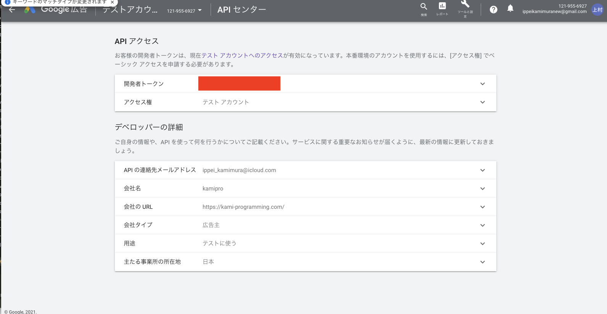

# line-bot-google-ads

# まずMCCアカウントを作りDEVELOPER TOKENを取得する。
https://ads.google.com/home/tools/manager-accounts/



上記画像の赤く塗りつぶした箇所にTOKENがあります。

# Google Developer ConsoleでOAuth2 クライアントIDとクライアントシークレットを取得
https://qiita.com/komedawara_omusubi/items/71f7da499d92289f77b6

token取得まわりはこの記事通りにすればできます。

# Start
各Tokenを.envに記載したら以下のコマンドを実行。

```
make start
```
