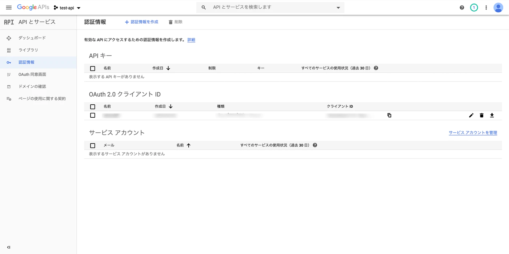

# line-bot-google-ads

# まずMCCアカウントを作りDEVELOPER TOKENを取得する。

<a href="https://ads.google.com/home/tools/manager-accounts/" target="_blank">
MCCを作成する
</a>


上記画像の赤く塗りつぶした箇所にTOKENがあります。

# Google Developer ConsoleでOAuth2 クライアントIDとクライアントシークレットを取得
## まずはGoogleAdsApiを有効化
<a href="https://console.developers.google.com/" target="_blank">
GoogleDeveloperConsole
</a>


## クライアント ID とクライアント シークレットを作成する
### 認証情報画面


### 認証作成


### OAuth クライアント ID の作成


### クライアントID とクライアント シークレットを取得


## リフレッシュトークンを取得する

### リフレッシュトークンを取得するためにgoogle adsのクライアントライブラリを取得する

```
$ git clone https://github.com/googleads/google-ads-php.git
$ cd google-ads-php
$ composer install
```

### リダイレクトURIのエンドポイントは以下
```
http://localhost/oauth2callback
```

ただし、これは後にリフレッシュトークンを取得するエンドポイントを作成したときにhttp://127.0.0.1:[ランダムなポート]/oauth2callbackとなってしうまうので、コンソール上で発行されたポートのURIでリダイレクトURIをアップデートします。


リフレッシュトークン取得用のURIを取得するためには以下を実行します。
```
$ php examples/Authentication/AuthenticateInWebApplication.php
Enter your OAuth2 client ID here: [クライアントID]
Enter your OAuth2 client secret here: [クライアントシークレット]
Log into the Google account you use for Google Ads and visit the following URL in your web browser: 
https://accounts.google.com/o/oauth2/v2/auth?response_type=code&access_type=offline&client_id=xxx&redirect_uri=http%3A%2F%2Flocalhost%2Foauth2callback&state=xxx&scope=https%3A%2F%2Fwww.googleapis.com%2Fauth%2Fadwords
```

ここで最後に発行されたURIをブラウザに打ち込み、認証を通すとターミナル上に以下の様なレスポンスが来ます。

```
[GOOGLE_ADS]
developerToken = "INSERT_DEVELOPER_TOKEN_HERE"
; Required for manager accounts only: Specify the login customer ID used to authenticate API calls.
; This will be the customer ID of the authenticated manager account. You can also specify this later
; in code if your application uses multiple manager account + OAuth pairs.
; loginCustomerId = "INSERT_LOGIN_CUSTOMER_ID_HERE"
[OAUTH2]
clientId = "[クライアントID]"
clientSecret = "[クライアントシークレット]"
refreshToken = "[取得したリフレッシュトークン]"
```

ここで取得したリフレッシュトークンを使いAPIリクエストを行います。


<a href="https://qiita.com/komedawara_omusubi/items/71f7da499d92289f77b6" target="_blank">
参考サイト
</a>


# Start
各Tokenを.envに記載したら以下のコマンドを実行。

```
make start
```

# ngrokでwebhookを動かしてlinebotを動かす。
```
./ngrok http -region=ap 8080
```
リージョンを選ばないとLineBotの挙動が不安定になる場合があります。
[](https://gyazo.com/4c47eb87d26773641a87eb4e1b49d8f4)